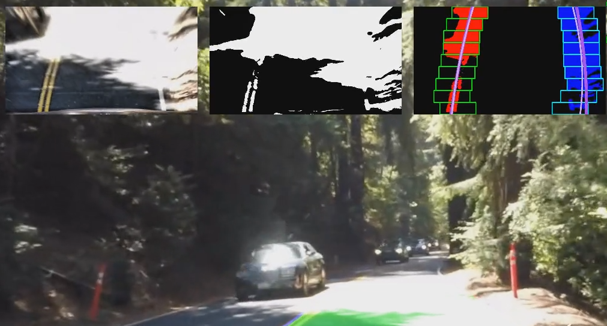

## Writeup Template

### You can use this file as a template for your writeup if you want to submit it as a markdown file, but feel free to use some other method and submit a pdf if you prefer.

---

**Advanced Lane Finding Project**

The goals / steps of this project are the following:

* Compute the camera calibration matrix and distortion coefficients given a set of chessboard images.
* Apply a distortion correction to raw images.
* Use color transforms, gradients, etc., to create a thresholded binary image.
* Apply a perspective transform to rectify binary image ("birds-eye view").
* Detect lane pixels and fit to find the lane boundary.
* Determine the curvature of the lane and vehicle position with respect to center.
* Warp the detected lane boundaries back onto the original image.
* Output visual display of the lane boundaries and numerical estimation of lane curvature and vehicle position.

[//]: # (Image References)

[image1]: ./examples/undistort_output.png "Undistorted"
[image2]: ./test_images/test1.jpg "Road Transformed"
[image3]: ./examples/binary_combo_example.jpg "Binary Example"
[image4]: ./examples/warped_straight_lines.jpg "Warp Example"
[image5]: ./examples/color_fit_lines.jpg "Fit Visual"
[image6]: ./examples/example_output.jpg "Output"
[video1]: ./project_video.mp4 "Video"

## [Rubric](https://review.udacity.com/#!/rubrics/571/view) Points

### Here I will consider the rubric points individually and describe how I addressed each point in my implementation.  

---

### Writeup / README

#### 1. Provide a Writeup / README that includes all the rubric points and how you addressed each one.  You can submit your writeup as markdown or pdf.  [Here](https://github.com/udacity/CarND-Advanced-Lane-Lines/blob/master/writeup_template.md) is a template writeup for this project you can use as a guide and a starting point.  

You're reading it!

### Camera Calibration

#### 1. Briefly state how you computed the camera matrix and distortion coefficients. Provide an example of a distortion corrected calibration image.

The code for this step is contained in the "Camera Calibration" section of the Jupyter notebook located in "./alf-project.ipynb".  

I start by preparing "object points", which will be the (x, y, z) coordinates of the chessboard corners in the world. Here I am assuming the chessboard is fixed on the (x, y) plane at z=0. Depending on the image I am discarding those object points corresponding to corners which have not been detected (this only affectts `calibration1.jpg`, `calibration4.jpg`, and `calibration5.jpg`). Object points corresponding to found image points are the same for each calibration image and are added to `objp`, and after successfully detecting the chessboard corners, `objp` will be appended to `objpoints`.  `imgpoints` will be appended with the (x, y) pixel position of each of the corners in the image plane with each successful chessboard detection -- see the `calibrate_camera()` function in the notebook.

I then used the output `objpoints` and `imgpoints` to compute the camera calibration and distortion coefficients using the `cv2.calibrateCamera()` function.  I applied this distortion correction to the test images using the `cv2.undistort()` function and obtained this result:


### Pipeline (single images)

#### 1. Provide an example of a distortion-corrected image.

I used the previously computed calibration and distortion coefficients to undistort the camera images using the `cv2.undistort()` function. Here is an example of several test images which were undistorted in this way


#### 2. Describe how (and identify where in your code) you used color transforms, gradients or other methods to create a thresholded binary image.  Provide an example of a binary image result.

I investigated different color spaces namely RGB, HSV, HLS, XYZ, LUV, and Lab


I tried different color masks and eventually settled with the L channel of LUV using a threshold of `220 <= L <= 255` to identify yellow lines, and with the b channel of Lab using a threshold of `150 <= b <= 200` to identify white lines.


Note: This image is not from the test images but from the challenge video to test also difficult lighting situations.

I also tried different combinations of gradient thresholds but this did not improve the result of the color selection hence I did not use it.


The final chosen binary mask thus only consisted of the L and b masks described above -- see also the `transformed_to_binary` function which is then used by the pipeline.

#### 3. Describe how (and identify where in your code) you performed a perspective transform and provide an example of a transformed image.

The code for my perspective transform is included in the function `warp_image`. The perspective transform used by this function is defined by the source (`src`) and destination (`dst`) points which are hard coded into the notebook
```python
    src = np.float32([[490, 482],[810, 482],[1250, 720],[40, 720]])
    
    dst = np.float32([[0,0],[img_size[1],0],[img_size[1],img_size[0]],[0,img_size[0]]])
```

I verified that my perspective transform was working as expected by drawing the `src` and `dst` points onto a test image and its warped counterpart to verify that the lines appear parallel in the warped image.


After perspective transformation, I also applied local histogram equalization which helped a lot in situations with low contrast or low lighting.


#### 4. Describe how (and identify where in your code) you identified lane-line pixels and fit their positions with a polynomial?

To identify the lanes, I wrote the `Lane` class which among actually finding the lanes also has several visualzation methods. The estimate for a polynomial approximation of the lane lines can be found in the `update_polynom` method which I describe in this section.

The image is divided into 9 stripes of height 80pixels. In the first iteration, I use the suggested histogram method from the course to define the position of the windows where to find lane segments. Subsequently, these windows are recentered to the mean of the lane segment if a sufficiently large segment is found. Otherwise, the window is recentered to the mean of a previously identified lane segment.


Note: Windows where no segments have been found are marked in red.

When all windows have been searched for lane segments, a 2nd order polynomial is fitted onto the found segments. If the curvature radius of the found polynomial is larger than 500m, the coefficients are added using exponential smoothing with `alpha = 0.3` to the best estimate of the current polynomial. The polynomials are represented by the purple lines in the above picture.

Moreover, if a lane segment is found somewhere in the picture, the polynomial fit is stabilized in all windows where no segments have been found by (x,y) points of the previously estimated polynomial (if available).


Note: The best estimate for the polynomial is shown in purple, the estimate of the current frame is shown in pink. The current left polynomial estimate is discarded because it violates the curvature condition. The current right polynomial estimate is stabilized in all red windows using coordinates from the previous estimate.

#### 5. Describe how (and identify where in your code) you calculated the radius of curvature of the lane and the position of the vehicle with respect to center.

The curvature calculation is done by the `update_curvature` method of the `Lane` class. I first compute the curvature from the coefficients of the polynomial approximation as shown in the course (see the `curvature_from_poly` function). At this point it is important to transform the pixel dimensions into world dimension. To keep things simple we make a _flat world_ assumption which is probably good enough for the first two videos.

To make the curvature estimation smoother, I first compute the curvature of the polynomial representation of the lane lines for the current frame. If the are reasonable, I add them to the current curvature estimate using exponential smoothing. Otherwise, they are discared.

#### 6. Provide an example image of your result plotted back down onto the road such that the lane area is identified clearly.

The function `draw_lane` of the `Lane` class returns an overlay image with left and right lane lines (blue and red) as well as drivable space in between (green). This image can be overlayed using the `cv2.addWeighted` function either directly on the perspective transformation of the road or on the original picture after applying the `unwarp_image` function which inverts the steps explained in section 3.


---

### Pipeline (video)

#### 1. Provide a link to your final video output.  Your pipeline should perform reasonably well on the entire project video (wobbly lines are ok but no catastrophic failures that would cause the car to drive off the road!).

Here are the links to the video results
- [project video](./project_video_out.mp4)
- [challenge video](./challenge_video_out.mp4)
- [harder challenge video](./harder_challenge_video_out.mp4)

---

### Discussion

#### 1. Briefly discuss any problems / issues you faced in your implementation of this project.  Where will your pipeline likely fail?  What could you do to make it more robust?

The pipeline works pretty well for the nice light highway scenarios of the first two videos. However, in the third video there are several major issues.

1. Even when clear lane markings are available, yellowish gras may add noise to the picture which leads to wrong lane segment estimation

    

    Here a more sophisticated binary mask may help also using sobel masks which take into account the direction of the lines. Also, using a more sophisticated plausibilization of the window search positions may help here because clear markings are available.

2. The curvature threshold (> 500m) is not suitable for country roads.

    

    In this situation, both lines are perfectly estimated but bot are discarded because of the estimated curvatures of 144m and 203m. However, to lower the threshold, the lane estimation has to be more robust in the highway scenarios. One may also use a plausibilization because most streets are built using clothoids, thus curvature has to be a smooth function of time.

3. Second order polynoms are not enough in curvy situations.

    

    In this situation, all segments of the right line are correctly detected, but the 2nd order fit just cannot do it because of the too high curvature. 3rd or 5th order polynomials may be more suitable but add additional challenges when a robust estimate is needed. One may also think about a curvature dependant estimate, i.e. when the curvature increases also the order of the polynomials is increased.


4. The window chosen for perspective transformation may be insufficient

    

    In this situation, the window chosen for the perspective transformation is not lare enough and thus looses a large part of the right lane.


5. The binary mask has difficulties with low lighting

    

    The thresholds chosen for the binary color mask filter out lane lines in low lighting situations even after applying the local histogram equalization. Lowering the thresholds would help here but creates additional challenges. One could try to use an adaptive approach which creates a new binary mask with different thresholds if no lanes are found in the previous iteration.

6. Camera blindness in case of extreme lighting gradients

    

    In this situation, the camera is essentially blind in certain areas of the image. Such areas could be identified and removed / damped to avoid instabilities.
